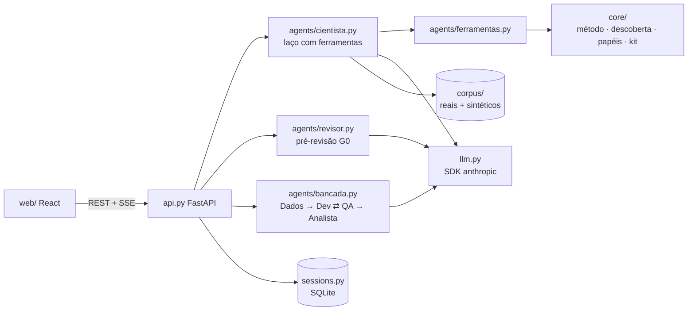

# cientista-lab · METAEXP

Plataforma de experimentação (IDP) do beOn Labs conduzida por agentes. Quatro papéis entram pela porta da frente:

| Papel | Porta | O que acontece |
|---|---|---|
| **Solicitante** | Tenho um desafio de negócio | O **Cientista** entende o problema a fundo com perguntas de alto valor, transforma em ficha e o laboratório executa na bancada. Nenhum jargão técnico. |
| **Desenvolvedor** | Quero construir algo | Conversa técnica: baseline, abordagens com trade-offs, protocolo de avaliação. Sai com a ficha e um **kit executável** (avaliador + CI que bloqueia regressões). |
| **Lab** | Reviso e aprovo experimentos | Fila de revisão (gate G0) com pré-análise do **Agente Revisor**, evidências da conversa e decisão em um clique. |
| **Sponsor** | Acompanho o portfólio | Portfólio por etapa, indicadores do metaexperimento e as decisões de escalar, iterar ou encerrar. |

Todos os agentes usam o Claude (`claude-opus-5-5`) pelo SDK oficial da Anthropic. O app é React; o backend é FastAPI.

## Como rodar

```bash
pip install -e ".[dev]"
cp .env.example .env              # ANTHROPIC_API_KEY, ou use `ant auth login`
(cd web && npm install && npm run build)
python -m metaexp servir          # http://localhost:8000 (API + app)
```

Para desenvolver o front com recarga instantânea: `python -m metaexp servir` em um terminal e `cd web && npm run dev` em outro (http://localhost:5173, com `/api` apontando para o backend).

Sem backend, o app entra em **modo demonstração** (ou force com `?demo`): um backend em memória com roteiros que percorrem o ciclo inteiro. Dá para criar uma ficha como Solicitante, trocar para Lab e aprovar, voltar e rodar a bancada, e decidir como Sponsor.

Com Docker: `docker build -t metaexp . && docker run -p 8000:8000 -e ANTHROPIC_API_KEY=... -v metaexp-data:/app/data metaexp`.

```bash
python -m pytest                  # 50 testes, sem rede e sem custo (cliente de modelo falso)
cd web && npm run typecheck       # contrato TypeScript
```

## O que diferencia o Cientista

### 1. Descoberta do problema antes da hipótese

O Cientista mantém um **mapa do problema** com dez dimensões (o que acontece, quem sente, tamanho, um caso real, causas, como se resolve hoje, decisão em jogo, como saberemos, restrições, premissa mais arriscada). A cada resposta, registra o que entendeu com profundidade de 0 a 3 e a fala da pessoa como evidência. O código (`metaexp/core/descoberta.py`) decide onde o entendimento está fraco e sugere técnicas de pergunta: caso concreto, ordem de grandeza, decisão destravada, quando desistir, cinco porquês etc. O modelo escreve a pergunta.

Na interface, cada pergunta vem com **"Por que pergunto isso"** (dimensão, técnica e motivo), o mapa aparece ao lado e, quando o problema fica claro, o Cientista resume o entendimento para a pessoa **confirmar antes da hipótese**. Escrever a hipótese com o mapa raso gera um aviso para o modelo.

### 2. Confiança verificável

Seguindo o que desenvolvedores dizem confiar em IA quando conseguem verificar a resposta e quando há atribuição ([Stack Overflow Developer Survey 2026](https://survey.stackoverflow.co/2026/ai/data)), o Cientista diz de onde vem cada sugestão: casos do histórico do Lab citados pelo id, cálculos feitos por ferramenta ou estimativas declaradas como estimativas. As regras do método são conferidas em código, não só pedidas ao modelo, e pessoas decidem nos portões G0–G3.

### 3. Experimento como código para o desenvolvedor

O protocolo de avaliação (conjunto, divisão, métricas técnicas com baseline e meta, gate de regressão) vira um kit (`metaexp/core/kit.py`): `experimento.yaml`, `eval/avaliar.py` sem dependências, `eval/metas.json`, workflow de CI e modelo de relatório. O CI avalia a cada push, falha se uma meta não for atendida ou se houver regressão contra o baseline congelado, e registra o histórico por commit. A ideia vem da avaliação de agentes em ciclos de integração contínua, em que o que importa é não regredir ao longo do tempo ([SWE-CI, arXiv 2603.03823](https://arxiv.org/abs/2603.03823)).

## Ciclo de vida

```
conversa → em_revisao (G0, Lab) → aprovado → em_execucao (bancada: G1 amostra, G2 Ralph Loop) → parecer (G3) → decidido (Sponsor)
                ↓
            devolvido → o Cientista retoma a conversa com o comentário do Lab
```

`METAEXP_REVISAO_LAB=0` desliga o G0 humano para times sem papel de Lab (a ficha é aprovada ao ser encaminhada).

## Arquitetura



| Pasta | O que tem |
|---|---|
| `metaexp/core/` | Domínio puro, sem rede nem modelo: `schemas.py` (contratos), `metodo.py` (regras oficiais), `descoberta.py` (mapa do problema), `papeis.py` (papéis e jornadas), `kit.py` (experimento como código), `stats.py`, `profiling.py`, `ficha_doc.py`. |
| `metaexp/llm.py` | Única porta para o modelo: `stream_turn` (chat com ferramentas) e `structured` (saída Pydantic). Prompt cacheado, esforço por uso, fallback no servidor quando um classificador recusa. |
| `metaexp/agents/` | `cientista.py` (laço de conversa), `ferramentas.py` (12 ferramentas estritas), `revisor.py` (pré-revisão), `bancada.py` (gates e Ralph Loop), `executor.py` (simulado; ponto de troca para sandbox). |
| `metaexp/prompts/` | Prompts em Markdown e a montagem dos contextos (`__init__.py`). |
| `metaexp/corpus/` | Corpus de experimentos, busca BM25 e golden paths. |
| `metaexp/sessions.py` | Sessões e ciclo de vida em SQLite (um documento JSON por experimento; troca para Postgres sem mudar o domínio). |
| `metaexp/api.py` | Rotas HTTP e SSE; serve o app de `web/dist`. |
| `metaexp/synthetic/`, `metaexp/evals/` | Ingestão do histórico e dataset sintético; avaliação do Cientista com solicitante simulado e juiz. |
| `web/src/api/` | Contrato TypeScript (`types.ts`), cliente ao vivo e backend de demonstração. |
| `web/src/features/` | `entrada`, `estudio` (conversa, mapa, ficha, desenho, kit), `bancada`, `lab`, `sponsor`. |

### Prompts

| Arquivo | Papel |
|---|---|
| `prompts/cientista.md` | Quem é o Cientista, como é um bom resultado, descoberta e arte da pergunta, método oficial (regras críticas inalteradas), ritmo, confiança, ferramentas e encerramento. |
| `prompts/papel_solicitante.md` / `papel_desenvolvedor.md` | Tom, profundidade e encerramento de cada jornada. |
| `prompts/revisor.md` | Rubrica do Lab (problema, hipótese, critérios, dados, viabilidade) com evidência por nota. |
| `prompts/bancada.md`, `sintetico.md`, `ingestao.md` | Agentes da bancada, gerador sintético e ingestão do histórico. |

O prompt de sistema de cada papel junta método, jornada, catálogo da descoberta, metodologia e golden paths, idêntico byte a byte entre turnos para aproveitar o cache. Instruções pontuais (auto-ingestão, feedback do Lab) entram como mensagens de sistema no meio da conversa, sem invalidar o prefixo.

### Método oficial garantido em código

| Regra | Como |
|---|---|
| Hipótese com "Acreditamos que", até 2 linhas, mensurável | `atualizar_ficha` avisa na hora; `gerar_ficha` recusa |
| Toda métrica com critério numérico e condição | idem |
| Nome com até 3 palavras; objetivo ≠ hipótese; BO e Sponsor | checklist de qualidade mínima |
| Auto-ingestão (mais de 400 caracteres ou 3+ seções) | detectada no servidor, que instrui o modelo com as pendências atuais |
| Encaminhar só com ficha gerada; uma vez por versão | `encaminhar` |
| Pré-revisão nunca recomenda aprovar com checklist pendente | `agents/revisor.py` |

## API

| Rota | Uso |
|---|---|
| `GET /api/health`, `GET /api/papeis` | estado do backend; papéis, jornadas, dimensões e técnicas |
| `POST /api/sessoes` | cria a conversa `{nome?, papel, preferencias}` |
| `GET /api/sessoes/{id}` | estado completo + transcrição |
| `POST /api/sessoes/{id}/iniciar` · `/mensagens` · `/arquivos` · `/retomar` | SSE: abertura, turno, amostra, retomada após o Lab |
| `POST /api/sessoes/{id}/bancada` | SSE: avança a bancada |
| `GET /api/sessoes/{id}/ficha.md` · `/kit` · `/kit.zip` | ficha oficial; kit do experimento |
| `GET /api/experimentos` · `GET /api/experimentos/{id}` | fila e detalhe (com transcrição e mapa) |
| `POST /api/experimentos/{id}/pre-revisao` · `/revisao` · `/decisao` | Agente Revisor; decisão G0 do Lab; decisão do Sponsor |
| `GET /api/portfolio` | indicadores (lead time, aprovação na 1ª revisão, cobertura do mapa, decisões pendentes) |

Eventos SSE do Cientista: `text`, `mapa`, `porque`, `ficha`, `card` (`sintese`, `similares`, `amostra`, `abordagens`, `avaliacao`, `desenho`, `tecnologia`, `skills`, `ficha_gerada`), `chips`, `upload`, `handoff`, `auto_ingestao`, `retry`, `error`, `done`. Da bancada: `etapa`, `mensagem`, `card` (`ficha`, `amostra`, `plano`, `rodada`, `parecer`), `aprovacao`, `aguardando`, `done`.

## Dataset a partir dos experimentos do Lab

```bash
python -m metaexp ingerir                         # data/real/ → data/corpus/real/ (fora do Git)
python -m metaexp plano-sintetico --n 60          # cobertura estratificada, sem chamar o modelo
python -m metaexp sintetico --n 300 --batch --sim # Batches API: metade do custo
python -m metaexp corpus                          # composição do corpus
```

## Avaliação

```bash
python -m metaexp avaliar --n 5 --sim
```

Um segundo modelo interpreta o solicitante sem ver a ficha final. Medidas determinísticas: jornada respeitada, encaminhamento, ficha completa, critérios numéricos, regras do método, **descoberta** (cobertura do mapa ≥ 0,6 e síntese confirmada) e turnos. O juiz dá notas a sete critérios, entre eles a **qualidade das perguntas**. Rode a cada mudança de prompt ou ferramenta.

## O que ainda é simulado

- **Execução do experimento** na bancada: `ExecutorSimulado` marca os resultados como simulados, e o parecer deixa isso visível. Para medir de verdade, implemente um executor em sandbox em `agents/executor.py`.
- **Busca no corpus**: BM25 lexical. Para milhares de experimentos, troque por busca híbrida mantendo a interface de `corpus/search.py`.
