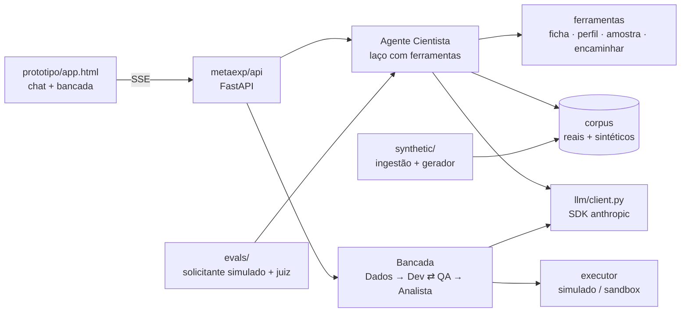

# cientista-lab · METAEXP

Plataforma de experimentação do beOn Labs orientada por agentes. A pessoa conversa com o **Agente Cientista**, que transforma um problema em uma ficha de experimento, analisa os dados enviados e descobre pela conversa se está falando com a área de negócio ou com um desenvolvedor. A área de negócio segue para a **bancada**, onde os agentes de Dados, Desenvolvedor, QA e Analista executam o experimento até o parecer. O desenvolvedor recebe a ficha final e executa por conta própria.

Todos os agentes usam o Claude (`claude-opus-5-5`) pelo SDK oficial da Anthropic.

## Como rodar

```bash
pip install -e ".[dev]"
cp .env.example .env          # preencha ANTHROPIC_API_KEY (ou use `ant auth login`)
python -m metaexp servir      # http://localhost:8000
```

O front em `prototipo/` detecta o backend sozinho: com a API no ar, o selo no topo mostra **LLM ao vivo** e a conversa usa o modelo; sem backend (por exemplo, no link publicado), ele roda o roteiro de demonstração.

```bash
python -m pytest              # 27 testes, sem rede e sem custo (cliente de modelo falso)
```

## Arquitetura



| Pasta | O que tem |
|---|---|
| `metaexp/llm/client.py` | Única porta para o modelo: `stream_turn` (chat com ferramentas, token a token) e `structured` (saída validada por Pydantic). Prompt de sistema cacheado, esforço por papel, fallback no servidor quando um classificador recusa. |
| `metaexp/context/` | Montagem dos contextos: metodologia do laboratório, catálogo de golden paths e prompts de cada papel. Contexto estável vai no prompt de sistema (idêntico byte a byte, para o cache); contexto variável entra pelas mensagens ou por ferramentas. |
| `metaexp/prompts/` | Prompts em Markdown: `cientista.md` (o roteiro da conversa), `bancada.md`, `sintetico.md`, `ingestao.md`. |
| `metaexp/tools/` | Ferramentas do Cientista (`atualizar_ficha`, `classificar_experimento`, `buscar_experimentos_similares`, `registrar_sinal_perfil`, `sugerir_respostas`, `solicitar_dados`, `calcular_tamanho_amostra`, `apresentar_skills`, `encaminhar`), perfil determinístico de arquivos e estatística. |
| `metaexp/agents/` | `cientista.py` (laço de conversa), `bancada.py` (etapas e gates G0–G3, com o Ralph Loop real entre Desenvolvedor e QA) e `executor.py` (resultados simulados hoje; ponto de troca para execução em sandbox). |
| `metaexp/corpus/` | Corpus de experimentos e busca BM25 em português, usada como memória do laboratório. |
| `metaexp/synthetic/` | Ingestão de documentos reais, taxonomia de variação, gerador sintético e controle de qualidade. |
| `metaexp/evals/` | Avaliação do Cientista com solicitantes simulados e juiz. |
| `metaexp/schemas.py` | Contratos de dados: `Ficha`, `AnaliseAmostra`, `PlanoTecnico`, `AvaliacaoQA`, `Resultados`, `Parecer`, `Experimento`. |
| `data/corpus/sintetico/` | Corpus inicial com 7 experimentos variados (domínio, técnica, perfil, dados, veredito). |

### Como o Cientista usa contexto

1. **Prompt de sistema** (fixo, cacheado): papel e roteiro da conversa, metodologia do beOn Labs, catálogo de golden paths com amostra mínima e skills de cada um.
2. **Histórico** (só cresce, nunca é editado): mantém o cache e os blocos de raciocínio válidos entre turnos.
3. **Ferramentas**: o Cientista busca experimentos semelhantes no corpus quando entende o problema, recebe o perfil dos arquivos enviados (estrutura, volume, qualidade, exemplos) e calcula tamanho de amostra de forma determinística.
4. **Estado da sessão**: ficha, sinais de perfil e arquivos ficam no servidor (`data/sessions/`) e voltam ao front como eventos.

## Dataset sintético a partir dos seus experimentos

O corpus é a memória do laboratório: dá contexto ao Cientista (casos semelhantes), serve de referência para gerar novos casos e vira casos de avaliação. Ele junta experimentos **reais** e **sintéticos** no mesmo formato (`Experimento`).

**1. Ingerir o que vocês já fizeram.** Coloque fichas, relatórios e pareceres em `data/real/` (PDF, DOCX, MD, TXT ou JSON; uma subpasta por experimento quando houver vários arquivos) e rode:

```bash
python -m metaexp ingerir
```

PDFs vão direto para o modelo como documento; DOCX tem texto e tabelas extraídos. Nomes de pessoas viram papéis. Os registros vão para `data/corpus/real/`, que, como `data/real/`, fica fora do Git.

**2. Planejar a cobertura** (sem chamar o modelo):

```bash
python -m metaexp plano-sintetico --n 60
```

A amostragem é estratificada em sete eixos: domínio, golden path, tecnologia, perfil do solicitante, situação dos dados (sem dados, amostra pequena, suficiente, sensíveis), veredito (validada, parcial, invalidada, inconclusiva) e estilo de conversa (vago, chega com a solução pronta, muito técnico, apressado...). Todo valor de cada eixo aparece antes de qualquer combinação se repetir, e combinações incoerentes são corrigidas (sem dados não termina "validada"). Ajuste os pesos em `synthetic/taxonomy.py` com a distribuição real da esteira.

**3. Gerar.** Cada especificação vira um experimento completo (ficha, amostra, conversa de elaboração, plano, resultados e parecer). Os experimentos reais mais parecidos entram como referência de estilo, então quanto mais documentos reais vocês ingerirem, mais o sintético se parece com o laboratório.

```bash
python -m metaexp sintetico --n 60 --sim            # uma chamada por experimento
python -m metaexp sintetico --n 300 --batch --sim   # Batches API: metade do custo, assíncrono
```

O controle de qualidade descarta registros com ficha incompleta, meta sem número, características diferentes das pedidas, veredito incoerente com as métricas ou quase duplicatas. Sem `--sim`, o comando só mostra quantas chamadas faria.

**4. Conferir.** `python -m metaexp corpus` mostra a composição (reais × sintéticos, domínios, tecnologias, vereditos).

## Avaliação

```bash
python -m metaexp avaliar --n 5 --sim
```

Para cada experimento do corpus com conversa, um segundo modelo interpreta o solicitante (perfil, problema, dados e jeito de falar) sem ver a ficha final. O caso avaliado sai do corpus de busca para o Cientista não "colar" a resposta. Ao final, a avaliação mede:

- **Determinísticas:** perfil detectado, encaminhamento coerente com o perfil, tecnologia, ficha completa, metas numéricas, turnos até o encaminhamento.
- **Juiz:** notas de 1 a 5 para uma pergunta por vez, problema antes da solução, insistência em metas numéricas, honestidade sobre dados e adaptação ao perfil.

O resultado vai para `data/evals/`. Rode sempre que mudar `prompts/cientista.md` ou as ferramentas.

## API

| Rota | Uso |
|---|---|
| `GET /api/health` | backend no ar, modelo e composição do corpus |
| `POST /api/sessoes` | cria uma sessão |
| `POST /api/sessoes/{id}/iniciar` | SSE: abertura do Cientista |
| `POST /api/sessoes/{id}/mensagens` | SSE: um turno de conversa `{texto}` |
| `POST /api/sessoes/{id}/arquivos` | SSE: análise de amostra `{nome, conteudo_base64}` |
| `POST /api/sessoes/{id}/bancada` | SSE: avança a bancada `{decisao?, comentario?}` |
| `GET /api/experimentos` | corpus e sessões |

Eventos SSE: `text`, `ficha`, `perfil`, `card` (`tecnologia`, `amostra`, `skills`, `similares`, `ficha`, `plano`, `rodada`, `parecer`), `chips`, `upload`, `handoff`, `etapa`, `mensagem`, `aprovacao`, `error`, `done`.

## O que ainda é simulado

- **Execução do experimento.** `ExecutorSimulado` pede ao modelo resultados plausíveis e marca tudo como `simulado`; o parecer e o relatório deixam isso visível. Para medir de verdade, implemente `ExecutorSandbox` em `agents/executor.py` (por exemplo, com a ferramenta de execução de código do Claude ou um contêiner próprio).
- **QA da bancada.** O Ralph Loop avalia o plano técnico contra os critérios da ficha. Com execução real, o QA passa a avaliar os outputs gerados.
- **Busca no corpus.** BM25 lexical atende algumas centenas ou milhares de experimentos. Para mais que isso, troque `corpus/search.py` por busca vetorial mantendo a interface.

## Proposta de pesquisa

A proposta de pesquisa aplicada (Design Science Research, gates G0–G3, Ralph Loop, métricas C, ΔT, A e S) é a referência de todos os conceitos usados aqui. As fórmulas estão em `metaexp/tools/stats.py` e `schemas.AvaliacaoQA.qualidade`.
